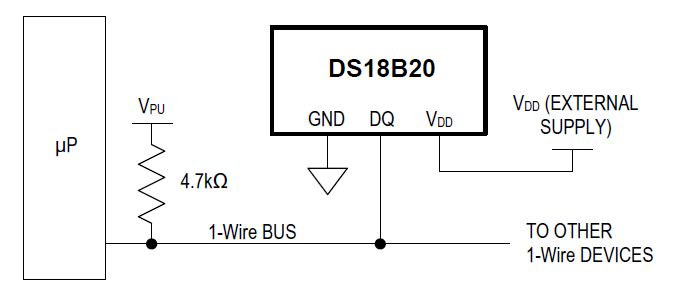

# 📘 Introduction to PIC32-DS18B20-Driver

   

This project offers a low-level API that facilitates interfacing between a microcontroller-based target and the external DS18B20 temperature sensor with digital interface. Despite being developed with the PIC32MX microcontroller and utilizing MPLAB X IDE alongside the XC32 compiler, this DS18B20 driver is adaptable to various other microcontroller-based environments.

# 📑 Table of Contents

- [📘 Introduction to PIC32-DS18B20-Driver](#-introduction-to-pic32-ds18b20-driver)
- [📑 Table of Contents](#-table-of-contents)
- [🌡️ Understanding DS18B20](#️-understanding-ds18b20)
- [✨ Features of the Driver](#-features-of-the-driver)
- [🛠️ Setting Up Your Environment](#️-setting-up-your-environment)
  - [Hardware Requirements and Setup](#hardware-requirements-and-setup)
  - [Software and Build Process](#software-and-build-process)
- [📚 Dependencies and Prerequisites](#-dependencies-and-prerequisites)
- [📖 API Documentation and Usage](#-api-documentation-and-usage)
  - [Macro Definitions](#macro-definitions)
  - [Data Types and Structures](#data-types-and-structures)
    - [`DsConfig_t`](#dsconfig_t)
  - [Driver Functions](#driver-functions)
    - [`DS18B20_SearchDeviceId()`](#ds18b20_searchdeviceid)
    - [`DS18B20_SearchAlarm()`](#ds18b20_searchalarm)
    - [`DS18B20_ConfigDevice()`](#ds18b20_configdevice)
    - [`DS18B20_SaveToRom()`](#ds18b20_savetorom)
    - [`DS18B20_CopyFromRom()`](#ds18b20_copyfromrom)
    - [`DS18B20_SetCorrection()`](#ds18b20_setcorrection)
    - [`DS18B20_IsConvDone()`](#ds18b20_isconvdone)
    - [`DS18B20_ConvertReadTemp()`](#ds18b20_convertreadtemp)
    - [`DS18B20_ConvertTemp()`](#ds18b20_converttemp)
    - [`DS18B20_ReadTemp()`](#ds18b20_readtemp)
    - [`DS18B20_ReadRam()`](#ds18b20_readram)
    - [`DS18B20_IsDeviceFake()`](#ds18b20_isdevicefake)
- [🖥️ Hands-on Examples](#️-hands-on-examples)
  - [Example: Temperature Conversion Using Multiple DS18B20 Sensors](#example-temperature-conversion-using-multiple-ds18b20-sensors)
- [📞 Getting in Touch and Contributions](#-getting-in-touch-and-contributions)
- [©️ License and Usage Terms](#️-license-and-usage-terms)
- [](#)

# 🌡️ Understanding DS18B20

The DS18B20 is a digital temperature sensor that provides precise and accurate temperature readings over a wide temperature range. Manufactured by Maxim Integrated, it utilizes a one-wire communication protocol, allowing multiple sensors to be connected to a single data line for efficient data retrieval. This sensor is widely popular in various applications due to its ease of use, reliability, and capability to provide temperature readings with a ±0.5°C accuracy in the range of -10°C to +85°C.

<div align="center">

<a id="fig1"></a>


**Figure 1**: DS18B20 Block Diagram.<br>
<small>Source: Maxim Integrated</small>
</div>

The DS18B20 operates on a 3.0V to 5.5V power supply, making it compatible with a broad range of microcontrollers and embedded systems. One of its distinguishing features is its programmable resolution, which ranges from 9 to 12 bits, allowing users to balance the trade-off between conversion time and measurement precision. The sensor’s unique 64-bit serial code enables the connection of multiple DS18B20 sensors on the same one-wire bus, facilitating the implementation of complex multi-point temperature monitoring systems.

Integrating the DS18B20 with microcontrollers is made straightforward thanks to its one-wire protocol, which reduces the number of required pins for operation. The availability of numerous libraries and drivers across various programming languages and platforms further simplifies its integration. Users can retrieve temperature data in a digital format directly from the sensor, eliminating the need for external ADC converters and streamlining the data acquisition process. This feature, combined with its compact size, makes the DS18B20 an excellent choice for both hobbyists and professionals working on temperature sensing applications in constrained spaces or with limited resources.

<div align="center">

<a id="fig2"></a>


**Figure 2**: Bus Connection Between MCU and DS18B20.<br>
<small>Source: Maxim Integrated</small>
</div>

The OneWire protocol enables communication between devices over a single data line, minimizing wiring complexity and making it ideal for connecting multiple devices in a network. Each device on the OneWire bus has a unique 64-bit serial number, allowing for accurate identification and data transmission. The protocol supports various operations including device discovery, data reading, and writing, and can even power devices directly through the data line using “parasitic power.” The DS18B20 temperature sensor is a prime example of a device utilizing the OneWire protocol for efficient data communication and power delivery.

<div align="center">

<a id="fig3"></a>


**Figure 3**: OneWire Protocol Timing Diagram.<br>
<small>Source: Maxim Integrated</small>
</div>

# ✨ Features of the Driver

The DS18B20 driver currently supports:
- DS18B20 search/scan over OneWire bus
- DS18B20 configuration
- DS18B20 temperature convert and read (polling and non-polling operation)

# 🛠️ Setting Up Your Environment

The development, testing, and API validation of the DS18B20 driver utilized the following setup.

## Hardware Requirements and Setup

Given the simplicity of DS18B20 sensor interface it usually comes as a 3-pin device. For THT type of housing the outer pins are usually the `VCC` and `GND` supply pins meanwhile the middle one is `DQ` data pin which acts as Rx/Tx pin. The MCU connects directly to this component, eliminating the need for intermediary components.

[!WARNING]
During testing of DS18B20 sensor make sure that a sufficient distance between sensor and MCU is guaranteed else there might be increased in measurement error due to increased ambient temperature nearby MCU due to its self heating.

## Software and Build Process
As mentioned earlier, the project development utilized MPLAB X (v6.05), paired with Microchip's XC32 (v4.21) toolchain for building the project. For detailed information on required libraries for using the DS18B20 driver, please refer to the [Dependencies and Prerequisites](#-dependencies-and-prerequisites) section.

# 📚 Dependencies and Prerequisites

[Figure 4](#fig4) illustrates the dependencies of the DS18B20 driver. <span style="color: #009999;">Green blocks</span> represent MCU peripheral drivers, primarily utilized for OneWire communication between the MCU and the DS18B20 external device, indicated by the <span style="color: #FF6666;">red block</span>. A timer serves as an additional feature, providing waiting period for the DS18B20 execute its measurement. The required MCU drivers for the PIC32MX device, used for the development and testing of this driver, were custom-developed and are accessible in a separate [repository](https://github.com/MucaGinger/PIC32MX-Peripheral-Libs).

<div align="center">

<a id="fig4"></a>


**Figure 4**: DS18B20 Library Dependencies.<br>
<small>Source: Maxim Integrated</small>
</div>

Besides the main DS18B20 driver dependencies there are other dependencies such as:
- Standard Libraries
- XC32 compiler libraries: `xc.h`, `cp0defs.h`, and `attribs.h`
- Register access header files (denoted as `xxx_sfr.h`)

Compiler libraries are mainly used for interrupt handler semantics, interrupt control, and accessing coprocessor registers *CP0* for some specialized tasks.

> [!NOTE]\
> It should be mentioned that the necessary startup file <code>.s</code>, linker file <code>.ld</code> (or <code>.sct</code> for ARM compilers), and MCU configuration bits (aka. fuses) are not provided in this project as these are toolchain and platform specifics and should be handled by the user.

# 📖 API Documentation and Usage

This section offers a brief introduction to the DS18B20 API. For comprehensive details, please refer to the [DS18B20_API_doc](DS18B20_API_doc.pdf). It's important to note that the `ds18b20.c` source file is thoroughly annotated with quality comment blocks for your convenience.

## Macro Definitions

The API employs preprocessor macros to facilitate a certain level of DS18B20 operation configuration. The following macro definitions may be modified:

- `DS_READ_RAM_REPEAT_COUNT` defines how many times the DS18B20 internal RAM may be re-read (due to possible CRC validation fail) before failing to obtain data
- `DS_SEARCH_DEVICE_REPEAT_COUNT` defines how many times the DS18B20 device search tries to restart search (due to possible CRC validation fail) before failing to identify DS18B20 devices on OneWire bus
- `DS_SAVE_COPY_ROM_TIMEOUT_MS` defines the maximum timeout of transferring the DS18B20 internal EEPROM content to RAM
- `DS_CONV_TEMP_TIMEOUT_MS` defines the maximum timeout after which any resolution of temperature measurement should be concluded. This value should be kept above the maximum measurement time of the 12-bit measurement which is the longest
- `DS_SEARCH_ID_TIMEOUT_MS` defines the maximum timeout after which DS18B20 stops searching in case of faulty behavior

## Data Types and Structures

Note that only `struct` types are outlined here. Other, `enum` types are assumed to be self-explanatory to the reader.

### `DsConfig_t`

This configuration structure is vital for setting up the DS18B20 before temperature measurement is commenced and provides with basic operation parameters.

## Driver Functions

> [!NOTE]
> The OneWire API overview is not covered here since its not intended for the user to call those functions manually in order to communicate with a DS18B20 device.

### `DS18B20_SearchDeviceId()`
```cpp
uint32_t DS18B20_SearchDeviceId(const uint32_t pinCode, uint64_t *romIdBuff);
```
This function performs ROM ID device search according to the predefined OneWire search algorithm.

### `DS18B20_SearchAlarm()`
```cpp
uint32_t DS18B20_SearchAlarm(const uint32_t pinCode, uint64_t *romIdBuff);
```
This function performs ROM ID device search according to the predefined OneWire search algorithm,
where only devices with alarm flag set will respond.

### `DS18B20_ConfigDevice()`
```cpp
bool DS18B20_ConfigDevice(DsConfig_t dsConfig, bool isMultiMode);
```
This function configures single/multiple device(s) according to the passed configuration structure.

### `DS18B20_SaveToRom()`
```cpp
bool DS18B20_SaveToRom(const uint64_t *romId, bool isMultiMode);
```
This function issues a data transfer from DS18B20’s internal scratchpad (RAM) to EEPROM.

### `DS18B20_CopyFromRom()`
```cpp
bool DS18B20_CopyFromRom(const uint64_t *romId, bool isMultiMode);
```
This function issues a data transfer from DS18B20’s internal EEPROM to scratchpad (RAM).

### `DS18B20_SetCorrection()`
```cpp
bool DS18B20_SetCorrection(float corr);
```
This function modifies internal temperature offset correction factor.

### `DS18B20_IsConvDone()`
```cpp
bool DS18B20_IsConvDone(void);
```
This function verifies whether any of DS18B20 devices on OneWire bus is executing a temperature conversion.

### `DS18B20_ConvertReadTemp()`
```cpp
bool DS18B20_ConvertReadTemp(const uint64_t *romId, float *dataBuff, const uint8_t deviceCount);
```
This function executes a polling-based temperature conversion with internal timeout and reads conversion results afterwards.

### `DS18B20_ConvertTemp()`
```cpp
bool DS18B20_ConvertTemp(const uint64_t *romId, const uint32_t deviceCount);
```
This function initiates a temperature conversion.

### `DS18B20_ReadTemp()`
```cpp
bool DS18B20_ReadTemp(const uint64_t *romId, float *dataBuff, const uint32_t deviceCount);
```
This function acquires and converts raw temperature data from DS18B20 device.

### `DS18B20_ReadRam()`
```cpp
bool DS18B20_ReadRam(const uint64_t *romId, int *dataBuff, const uint32_t deviceCount);
```
This function reads high alarm, low alarm, and measurement resolution of a single device.

### `DS18B20_IsDeviceFake()`
```cpp
bool DS18B20_IsDeviceFake(const uint64_t *romId);
```
This function verifies whether a specific DS18B20 device is a fake device.

# 🖥️ Hands-on Examples

This section showcases how to utilize the API covered in the previous section, providing practical examples. The examples are briefly summarized for demonstration purposes. For comprehensive details, please refer to the [DS18B20_API_doc](DS18B20_API_doc.pdf) documentation.

## Example: Temperature Conversion Using Multiple DS18B20 Sensors

Below is the full example of how to configure multiple DS18B20 devices to same operation settings, initiate temperature conversion, and acquire measurement data. Before configuration is done we first acquire 64-bit wide identification ROM numbers which are later used to identify individual devices and communicate with each separately during verification whether active devices are considered fake or not. In this example all device's temperature measurement is initiated simultaneously. However, after successfully obtaining its ROM ID it is possible to communicate with each device separately from other DS18B20 devices on the OneWire bus.

```cpp
/** Required by OneWire.h for Tmr.h **/
#define TMR_DELAY_SYSCLK 40000000

/** Custom libs **/
#include "DS18B20.h"

int main (int argc, char** argv)
{
    /* Pin toggle during timeout */
    PIO_ClearPin(GPIO_RPB4);
    PIO_ConfigGpioPin(GPIO_RPB4, PIO_TYPE_DIGITAL, PIO_DIR_OUTPUT);
    
    OwConfig_t owConfigBus = 
    {
        .pinCode = GPIO_RPB5,
        .speedMode = OW_STANDARD_SPEED
    };
    
    /* Configuration structure for multiple devices */
    DsConfig_t dsConfig = {
        .measRes = DS_MEAS_RES_12BIT,
        .owConfig = owConfigBus,
        .highAlarm = 40,
        .lowAlarm = 24
    };
    
    /* Identify all DS18B20 devices */
    uint64_t romId[10] = {0};
    uint32_t deviceCount;
    deviceCount = DS18B20_SearchDeviceId(owConfigBus.pinCode, romId);
    
    /* Check if any are fake - have fixed conversion time */
    for (uint8_t idx = 0; idx < deviceCount; idx++)
    {
        if (DS18B20_IsDeviceFake(&romId[idx]))
        {
            dsConfig.measRes = DS_MEAS_RES_12BIT;
            break;
        }
    }
    
    /* Multiple devices on OW bus check */
    bool isMultiMode;
    isMultiMode = (deviceCount > 1) ? true : false;
    
    float data[deviceCount];
    
    /* Configure device */
    if (DS18B20_ConfigDevice(dsConfig, isMultiMode))
    {
        /* Store alarm settings */
        DS18B20_SaveToRom(romId, isMultiMode);
        
        /* Start temperature conversion with internal timeout */
        DS18B20_ConvertTemp(romId, deviceCount);
        
        /* Wait for timeout */
        while (!DS18B20_IsConvDone())
        {
            PIO_TogglePin(GPIO_RPB4);
        }
        
        /* Store results */
        DS18B20_ReadTemp(romId, data, deviceCount);
    }
    else
    {
        /* Do not proceed until device successfully configured */
    }
    
    /* Do alarm flag search */
    uint64_t alarmRomId[10];
    uint32_t alarmCount;
    alarmCount = DS18B20_SearchAlarm(owConfigBus.pinCode, alarmRomId);
    
    /* Devices at 25-40°C won't have their alarm flags set */
    
    /* Reconfigure to another alarm setting */
    dsConfig.lowAlarm = 0;
    dsConfig.highAlarm = 15;
    DS18B20_ConfigDevice(dsConfig, isMultiMode);

    /* Do another conversion */
    DS18B20_ConvertReadTemp(romId, data, deviceCount);

    /* Do another alarm search */
    alarmCount = DS18B20_SearchAlarm(owConfigBus.pinCode, alarmRomId);
    
    /* Alarm should be now triggered for devices above 15°C */
    
    /* Restore alarm settings */
    DS18B20_CopyFromRom(romId, isMultiMode);
    
    /* Check one of devices' EEPROM if successfully copied */
    int ramData[3];
    DS18B20_ReadRam(romId, ramData, 1);
    
    /* Do third conversion */
    DS18B20_ConvertReadTemp(romId, data, deviceCount);

    /* Do third alarm search */
    alarmCount = DS18B20_SearchAlarm(owConfigBus.pinCode, alarmRomId);
    
    /* This time devices at 25-40°C won't have their alarm flags set */

    /* Example code end */
    while (1)
    {}
    
    return 0;
}
```

# 📞 Getting in Touch and Contributions

If you encounter any bugs or have suggestions, please [raise an issue](https://github.com/MucaGinger/PIC32-DS18B20-Driver/issues). Alternatively, feel free to contact me directly via [email](mailto:lgacnik97@gmail.com) if you're interested in contributing or taking this project to the next level.

# ©️ License and Usage Terms

This project is licensed under the MIT License - see the [LICENCE](LICENCE) file for details.

#

&copy; Luka Gacnik, 2023